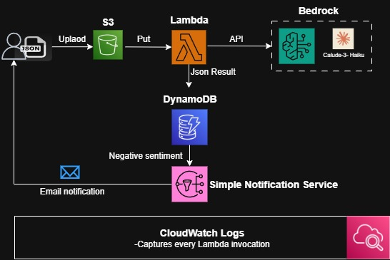

# Sentimental Detective

Sentimental Detective is a serverless AWS system designed to analyze customer reviews using natural language processing (NLP). It detects sentiment, urgency, and key topics from review text using Amazon Bedrock (Claude) and stores structured insights in DynamoDB. If a review is negative, the system triggers an alert using Amazon SNS.

## Features

- Extracts customer review data from `.json` files uploaded to S3
- Analyzes sentiment using Amazon Bedrock (Claude model)
- Parses model output and stores it in DynamoDB with TTL
- Sends SNS notifications for negative reviews
- Fully event-driven and scalable using AWS Lambda

## Architecture Diagram

See the following file for the system architecture:


## Tech Stack

| Component     | AWS Service Used           |
|---------------|-----------------------------|
| Compute       | AWS Lambda                  |
| Object Storage| Amazon S3                   |
| NLP Model     | Amazon Bedrock (Claude)     |
| Database      | Amazon DynamoDB             |
| Notifications | Amazon SNS                  |

## How It Works

1. A `.json` file containing a review is uploaded to a configured S3 bucket.
2. S3 triggers a Lambda function.
3. The function reads the file and sends the review text to Amazon Bedrock for analysis.
4. The response is parsed, cleaned, and stored in DynamoDB.
5. If the sentiment is negative, an SNS notification is triggered.

## Sample Input (JSON)

```json
{
    "overall": 3.0,
    "asin": "7508492919",
    "reviewerID": "AB6CHQWHZW4TV",
    "reviewText": "so the case came on time, i love the design. I'm actually missing 2 studs but nothing too noticeable the studding is almost a bit sloppy around the bow, but once again not too noticeable. I haven't put in my phone yet so this is just what I've notice so far",
    "reviewTime": "02 8, 2014"
}